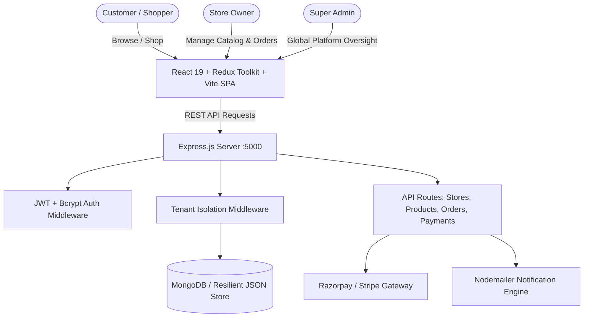

# 🛍️ OmniMarket - Multi-Tenant E-Commerce & Dining SaaS Platform

[](https://react.dev/)
[](https://vitejs.dev/)
[](https://redux-toolkit.js.org/)
[](https://tailwindcss.com/)
[](https://nodejs.org/)
[](https://www.mongodb.com/)
[](https://razorpay.com/)

**OmniMarket** is a multi-tenant digital commerce and dining SaaS platform. It offers isolated storefronts for various businesses (Electronics, Fashion, Dining & Restaurants, Grocery, Furniture, and Tours & Travels) while maintaining unified marketplace discovery, price comparison matrices, cart & checkout, vendor management dashboards, and super admin moderation.

---

## 🌟 Key Highlights

- 🏢 **Multi-Tenant Architecture**: Dynamic tenant routing, database scoping, and strict data isolation across independent businesses.
- 🏪 **Custom Storefronts**: Tailored branding, custom category banners, opening hours, contact information, and live product catalogs per store.
- ⚖️ **Cross-Store Price Comparison Matrix**: Compare tech gadgets and essentials across major retail tenants in real time.
- 🛒 **Unified Cart & Slide-out Drawer**: Seamless multi-item cart management with instant tax and subtotal computation.
- 💳 **Dual Payment Gateway Integration**: Native checkout flows supporting **Razorpay** (UPI, Cards, NetBanking) and **Stripe** with webhook verification.
- 📊 **Vendor Management Dashboard**: Real-time sales statistics, revenue counters, order tracking, and product CRUD capabilities.
- 🛡️ **Super Admin Control Center**: Global oversight over all registered tenants, platform revenue metrics, merchant approval, and status toggles.
- 💾 **Resilient Multi-Mode Storage**: Supports MongoDB with automatic local JSON fallback for environments without an active MongoDB instance.

---

## 🏛️ System Architecture



---

## 🛠️ Technology Stack

| Layer | Technologies |
|---|---|
| **Frontend** | React 19, Redux Toolkit, React Router v7, Tailwind CSS v4, Lucide React, Vite |
| **Backend** | Node.js, Express.js 4, Mongoose 8, Helmet, CORS, Express Rate Limit |
| **Authentication** | JSON Web Tokens (JWT), Bcrypt.js password hashing |
| **Payments** | Razorpay SDK, Stripe SDK |
| **Media & Assets** | Cloudinary / Multer Storage integration, SVG Vector illustrations |
| **Notifications** | Nodemailer SMTP email service |

---

## 🏬 Registered Tenants & Demo Credentials

Each store has its own dedicated credentials for logging into the **Vendor Portal**:

| Store Name | Category | Email | Demo Password |
|---|---|---|---|
| **Poonam Dresses** | Clothing & Fashion | `poonam@dresses.com` | `Poonam@2026` |
| **Vijay Sales** | Electronics | `vijay@sales.com` | `VijaySales@2026` |
| **Croma** | Electronics | `croma@retail.com` | `Croma@2026` |
| **Reliance Digital** | Electronics | `reliance@digital.com` | `Reliance@2026` |
| **SS Mobile Shop** | Mobile & Gadgets | `ss@mobile.com` | `SSMobile@2026` |
| **Wow! Momo** | Dining & Fast Food | `wow@momo.com` | `WowMomo@2026` |
| **Dragon Chinese Wok** | Restaurant & Dining | `dragon@chinesewok.com` | `ChineseWok@2026` |
| **Mamta Sweets & Namkeen**| Sweets & Snacks | `mamta@sweets.com` | `Mamta@2026` |
| **Rajgad Tours & Travels** | Tours & Travels | `rajgad@travels.com` | `Rajgad@2026` |
| **Shri Ram Furniture** | Home & Furniture | `shriram@furniture.com` | `ShriRam@2026` |
| **Daily Fresh Grocery** | Grocery & Supermarket | `dailyfresh@grocery.com`| `DailyFresh@2026` |
| **Pure Organic Farm** | Organic Produce | `pure@organic.com` | `Organic@2026` |

> 🔑 **Super Admin Credentials**: `admin@omnimarket.io` / `Admin@2026`

---

## 🚀 Getting Started

### 1. Prerequisites
- **Node.js** (v18.0.0 or higher)
- **npm** (v9.0.0 or higher)
- **Git**

### 2. Clone the Repository
```bash
git clone https://github.com/samarth13p2417-bit/Multi-Tenants-E-commerce-Saas-.git
cd Multi-Tenants-E-commerce-Saas-
```

### 3. Install Dependencies
Install dependencies across the root, backend, and frontend packages:
```bash
# Root & Workspace Dependencies
npm install

# Backend Dependencies
cd backend && npm install && cd ..

# Frontend Dependencies
cd frontend && npm install && cd ..
```

### 4. Configure Environment Variables
Create a `.env` file in the `backend/` directory from the provided `.env.example`:
```bash
cp backend/.env.example backend/.env
```

Review or modify the parameters in `backend/.env`:
```ini
PORT=5000
NODE_ENV=development
MONGODB_URI=mongodb://127.0.0.1:27017/omnimarket
JWT_SECRET=OmniMarket_Super_Secret_JWT_Key_#2026
RAZORPAY_KEY_ID=your_razorpay_key_id
RAZORPAY_KEY_SECRET=your_razorpay_key_secret
```

### 5. Run the Application
Run both the frontend client and backend API concurrently with a single command:
```bash
npm run dev
```

- **Frontend Client**: [http://127.0.0.1:5173](http://127.0.0.1:5173)
- **Backend API**: [http://localhost:5000](http://localhost:5000)
- **API Health Check**: [http://localhost:5000/api/health](http://localhost:5000/api/health)

---

## 📡 REST API Reference

| Endpoint | Method | Description | Auth Required |
|---|---|---|---|
| `/api/auth/login` | `POST` | User & Vendor login (returns JWT token) | No |
| `/api/auth/register` | `POST` | Register customer or new store tenant | No |
| `/api/auth/me` | `GET` | Get profile of authenticated user | Yes |
| `/api/stores` | `GET` | Fetch all registered tenant stores | No |
| `/api/stores/:id` | `GET` | Fetch single tenant store information | No |
| `/api/products` | `GET` | Fetch products (filterable by `tenantId`, `category`) | No |
| `/api/products` | `POST` | Create new product listing | Vendor / Admin |
| `/api/orders` | `GET` | List orders for current tenant or customer | Yes |
| `/api/orders` | `POST` | Create a new customer order | Yes |
| `/api/payments/razorpay/create-order` | `POST` | Initialize Razorpay payment intent | Yes |
| `/api/payments/razorpay/verify` | `POST` | Verify Razorpay payment signature | Yes |

---

## 📂 Project Structure

```text
├── backend/
│   ├── config/             # DB, Stripe, Razorpay & Cloudinary configs
│   ├── middleware/         # Auth, Tenant isolation, Security handlers
│   ├── models/             # Mongoose schemas (Tenant, Product, Order, User)
│   ├── routes/             # REST endpoint route controllers
│   ├── services/           # Nodemailer & external notification services
│   ├── server.js           # Server bootstrap & fallback handler
│   └── package.json
│
├── frontend/
│   ├── public/             # Static logos, icons, SVG store covers
│   ├── src/
│   │   ├── app/            # Redux Toolkit store setup
│   │   ├── components/     # UI components (Navbar, CartDrawer, Cards, Modals)
│   │   ├── data/           # Stores data, credentials & comparison datasets
│   │   ├── features/       # Redux slices (authSlice, marketplaceSlice)
│   │   ├── pages/          # HomePage, StorePage, VendorDashboard, AdminDashboard
│   │   ├── services/       # Axios API client
│   │   └── App.jsx         # App router & layout routes
│   └── package.json
│
├── scripts/                # Asset generation and automation utilities
├── .gitignore              # Git ignore rules for node_modules and secrets
└── package.json            # Top-level workspace script configurations
```

---

## 📄 License
This project is private and maintained for the Multi-Tenants E-commerce SaaS platform.
